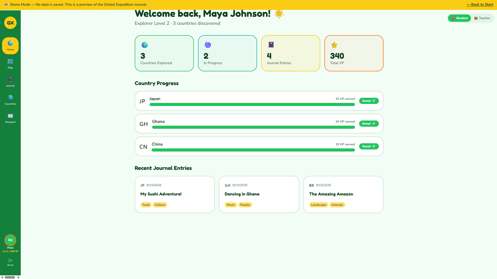
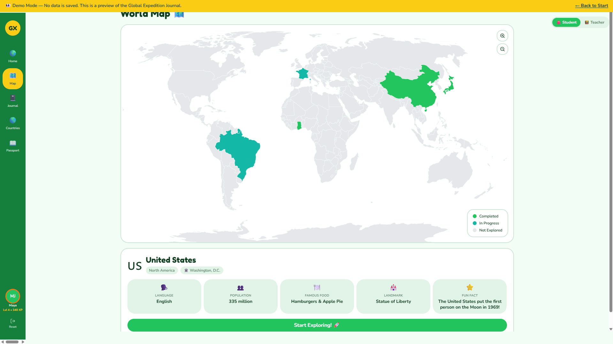
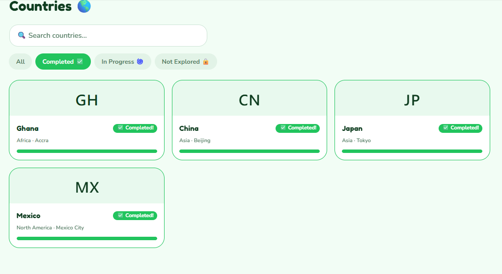
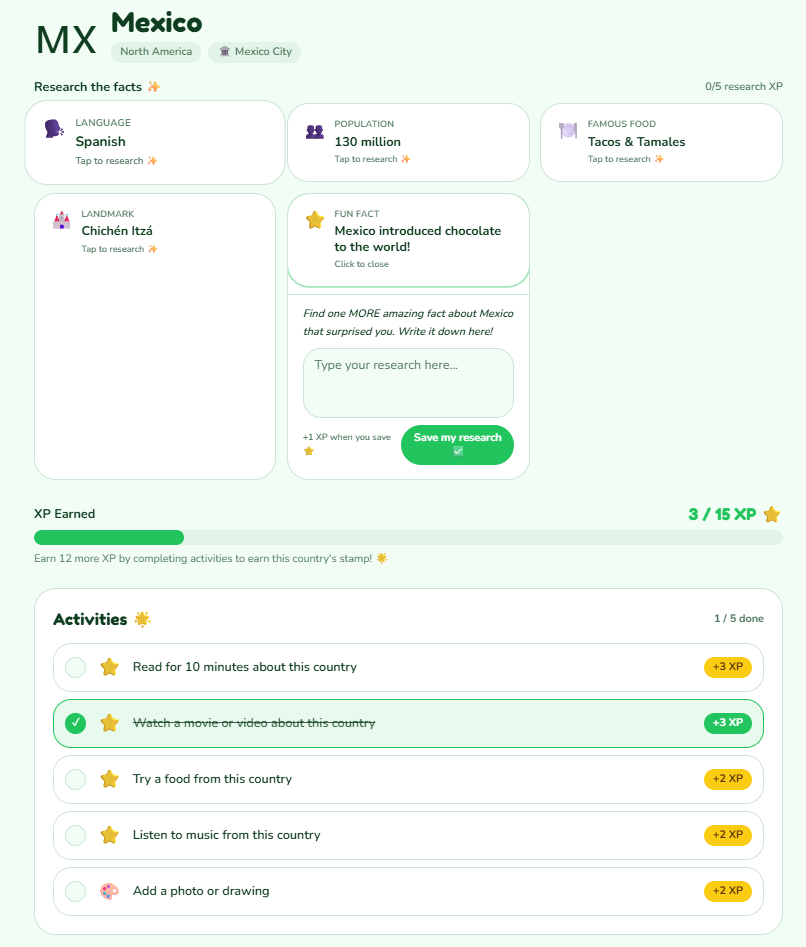
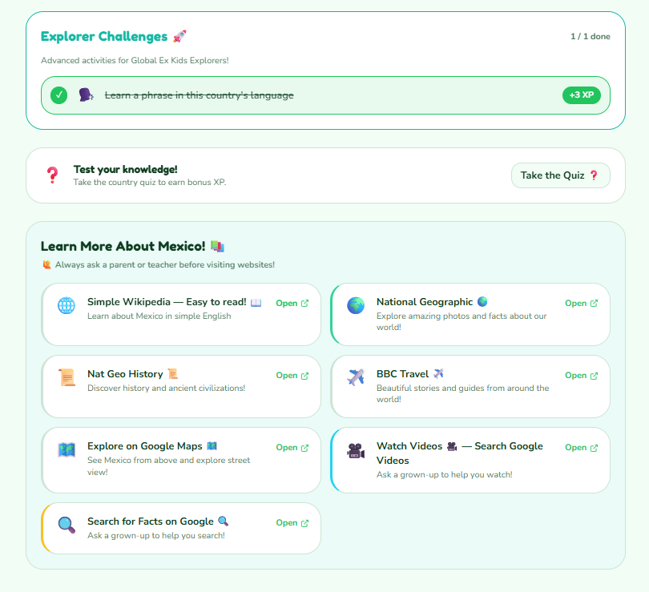
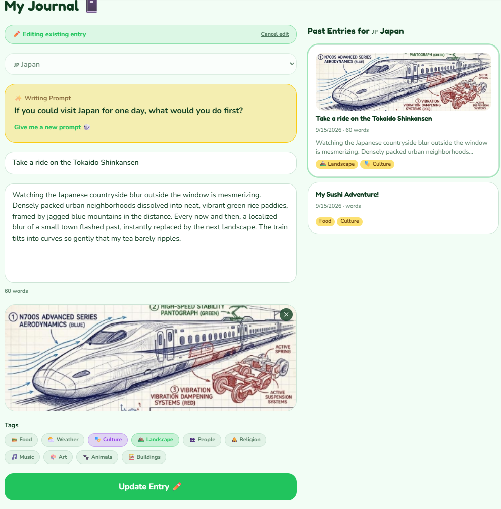
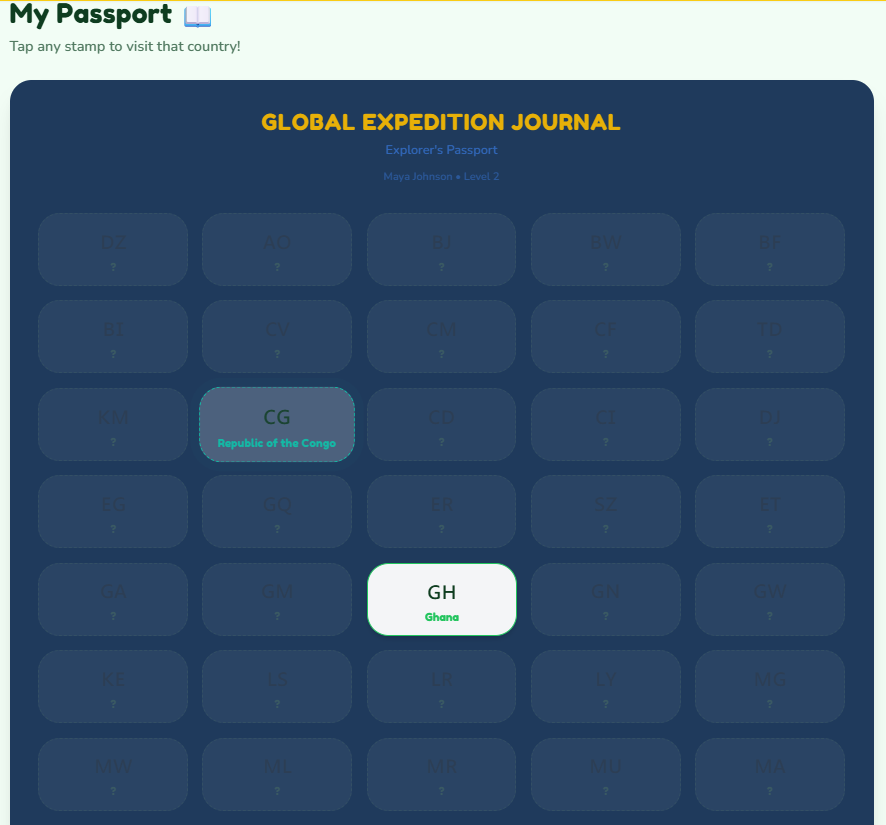
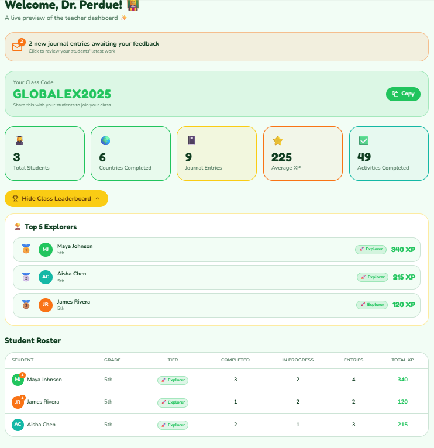

# Global Expedition Journal

A full-stack educational web application that helps students explore all 195 countries through guided research, quizzes, digital journaling, gamified progression, and teacher-supported learning.

[**Live Demo**](https://globe-explorer-passport.lovable.app/) · [**Demo Video**](https://drive.google.com/file/d/1sk2XpoDBIPX1KCmV79zdjfs7Ry_cDYiM/view?usp=sharing) · [**Presentation**](https://docs.google.com/presentation/d/1zTZE5I8KgdN6PaqBAc8NlFFjZAb4Qq_qFgvq2XIXMzg/edit?usp=sharing) · [**Case Study**](docs/CASE-STUDY.md) · [**Architecture**](docs/ARCHITECTURE.md) · [**QA & Iteration**](docs/QA-AND-ITERATION.md)

> **Portfolio note:** The linked demo is a separate no-login environment populated with demonstration data so reviewers can explore the product without accessing organizational or user data.



## Overview

Global Expedition Journal was developed for Global Ex Education as an interactive learning experience designed to make global education more engaging, exploratory, and accessible.

I served as the **sole technical developer and primary product builder**, translating the educational concept into a working full-stack application. I owned the technical implementation, application structure, data organization, user flows, feature development, testing, debugging, iteration, and demo preparation.

The product combines self-paced country exploration with journaling, quizzes, progression, a digital passport, and teacher-supported learning. A complementary Canvas LMS experience was designed for structured assignments, reflection, discussion, and classroom community.

## Key Features

- **195-country exploration model** with structured content for geography, culture, language, food, landmarks, facts, and quizzes
- **Interactive world map** with exploration states and country-specific navigation
- **Guided country learning** with research prompts, activities, resources, and quizzes
- **Digital journal** with country association, tags, written reflections, and image support
- **XP and progression system** tied to student activities and country progress
- **Digital passport** for visualizing completed and in-progress countries
- **Student and teacher experiences** with role-aware navigation and Supabase-backed access policies
- **Teacher tools** for class visibility, student progress, journal feedback, tags, and learning resources
- **Responsive UX** for desktop, tablet, and mobile use
- **Separate public demo** with seeded demonstration state for portfolio review

## Product Walkthrough

### Explore the World



Students can browse an interactive map, see exploration status, and open country-specific learning experiences.

### Browse Countries



The country directory provides searchable and filterable access to the full country dataset, with status-aware cards for completed, in-progress, and not-yet-explored countries.

### Learn About a Country



Country pages combine structured reference content, research prompts, learning activities, progress tracking, and quizzes.



### Document the Journey



Students can record reflections and discoveries in a country-linked journal using text, tags, and images.

### Track Progress



The passport and XP system turn learning activity into visible progression across a student's global learning journey.

### Support Learning



Teacher-facing functionality provides class-level visibility and tools for reviewing student progress, leaving journal feedback, and managing learning resources.

## My Role

I was responsible for the technical implementation and product development of Global Expedition Journal, including:

- Translating educational goals and product requirements into application features
- Designing the application structure, navigation, and student/teacher workflows
- Building and organizing a typed content model containing all 195 countries
- Implementing country exploration, quizzes, journaling, XP, progression, and passport workflows
- Implementing authentication and role-aware application behavior
- Building Supabase-backed data flows for profiles, roles, class-code grouping, progress, journals, activities, teacher feedback, tags, and resources
- Implementing responsive interfaces for desktop and mobile use
- Conducting scenario-based acceptance and UX testing
- Identifying and resolving defects across access control, onboarding, routing, navigation, journaling, progression, and teacher workflows
- Building a separate no-login demo environment using seeded demonstration data
- Preparing technical demonstrations and presentation materials

## Technology

**Frontend**
- React
- TypeScript
- Vite
- Tailwind CSS
- React Router
- TanStack Query
- React Hook Form
- react-simple-maps
- Radix UI / shadcn-style components
- canvas-confetti

**Backend & Data**
- Supabase
- PostgreSQL
- Supabase Auth
- Row Level Security (RLS)
- Supabase Storage

**Development & QA**
- Git / GitHub
- Vitest
- ESLint

## Architecture

The application separates authentication flows, student workflows, teacher workflows, structured country content, and authenticated user-generated data.

- **React/TypeScript client:** navigation, map, country learning, journal, passport, progression, and teacher UI
- **Structured country content:** a typed 195-country data model containing metadata, facts, landmarks, food, languages, and quiz content
- **Supabase relational layer:** profiles, roles, class-code grouping, exploration progress, journal entries, activities, XP ledger, country research, teacher feedback, tags, and resources
- **Authorization:** Row Level Security plus role-aware application routing
- **Demo environment:** a separate no-login application with seeded demo state for portfolio review

See [Architecture](docs/ARCHITECTURE.md) for a deeper breakdown.

## Data Model

The product uses two complementary data layers:

1. **Structured educational content** for all 195 countries, stored as typed application data.
2. **Relational application data** in Supabase/PostgreSQL for authenticated and user-generated state.

The relational layer supports profiles, user roles, class-code grouping, country exploration progress, journal entries, student activities, XP, research activity, teacher comments/ratings, custom tags, and teacher-managed resources.

This separation keeps reference content predictable while allowing student progress, classroom relationships, and feedback to remain dynamic and user-specific.

## QA & Iteration

The project used **scenario-based acceptance and UX testing across eight major modules**:

1. Authentication and security
2. Dashboard and navigation
3. Interactive world map
4. Country learning journey
5. Journaling
6. Gamification and passport
7. Teacher dashboard
8. Mobile responsiveness and UX

The testing process focused on high-risk workflows such as role boundaries, password recovery, onboarding, routing, progress tracking, journal media, XP behavior, teacher feedback, and responsive navigation.

Testing drove or validated improvements including role-aware routing and access-control policies, account-recovery flows, onboarding support, dedicated progress routes, richer journal data, XP/passport interactions, teacher feedback tools, and mobile/desktop navigation behavior.

See [QA & Iteration](docs/QA-AND-ITERATION.md) for the complete engineering summary.

## Product Context

The product grew from Global Ex Education's goal of making global learning accessible to students who may not have the opportunity to travel. The broader learning model pairs:

- **Global Expedition Journal:** self-paced exploration, research, progress tracking, journaling, and gamification
- **Canvas LMS:** structured assignments, reflection, discussion, instructor-led experiences, and classroom community

The result is a dual learning ecosystem that combines independent exploration with guided educational experiences.

## Presentation

Global Expedition Journal was demonstrated as part of a broader educational technology initiative using a live application demo, presentation materials, and an interactive project board.

[**View the full presentation**](https://docs.google.com/presentation/d/1zTZE5I8KgdN6PaqBAc8NlFFjZAb4Qq_qFgvq2XIXMzg/edit?usp=sharing)

Additional project context and the development story are documented in the [Case Study](docs/CASE-STUDY.md).

## Demo

**Live no-login demo:**

https://globe-explorer-passport.lovable.app/

**Demo video:**

https://drive.google.com/file/d/1sk2XpoDBIPX1KCmV79zdjfs7Ry_cDYiM/view?usp=sharing

The demo environment is intentionally separate from the authenticated application and uses seeded demonstration data.

## Running Locally

### Prerequisites

- Node.js 22.12+
- npm
- A Supabase project for authenticated/backend functionality

### Setup

```bash
git clone https://github.com/yaseenmahdi/global-expedition-journal.git
cd global-expedition-journal
npm ci
cp .env.example .env
# Add your Supabase client values to .env
npm run dev
```

On Windows PowerShell, use `Copy-Item .env.example .env` instead of `cp`.

The authenticated application requires valid Supabase client configuration before it can render locally. If `.env` is missing or still contains placeholders, the Vite server may start successfully while the browser shows a blank page because the Supabase client cannot initialize.

Required local values:

- `VITE_SUPABASE_URL`
- `VITE_SUPABASE_PUBLISHABLE_KEY`

Use a browser-safe Supabase publishable/anon key only. Never place a Supabase service-role key or another server secret in a `VITE_*` variable or commit it to the repository.

The public no-login demo is separate from this authenticated local setup and can be reviewed without configuring Supabase: [Live Demo](https://globe-explorer-passport.lovable.app/).

### Verify

```bash
npm run lint
npm run typecheck
npm test
npm run build
```

## Environment Variables

Use `.env.example` as the local configuration template.

The client requires browser-safe Supabase values:

- `VITE_SUPABASE_URL`
- `VITE_SUPABASE_PUBLISHABLE_KEY`

Never place a Supabase service-role key or another server secret in a `VITE_*` variable or in the repository.

## Project Status

Global Expedition Journal is a working educational technology prototype with an authenticated application, student and teacher workflows, and a separate public demonstration environment.

The public repository documents the implementation and product-development process while keeping real user data and private organizational information out of source control. It is a portfolio prototype, not a production security baseline for real student data without additional authorization and storage hardening.

## Documentation

- [Case Study](docs/CASE-STUDY.md)
- [Architecture](docs/ARCHITECTURE.md)
- [QA & Iteration](docs/QA-AND-ITERATION.md)
