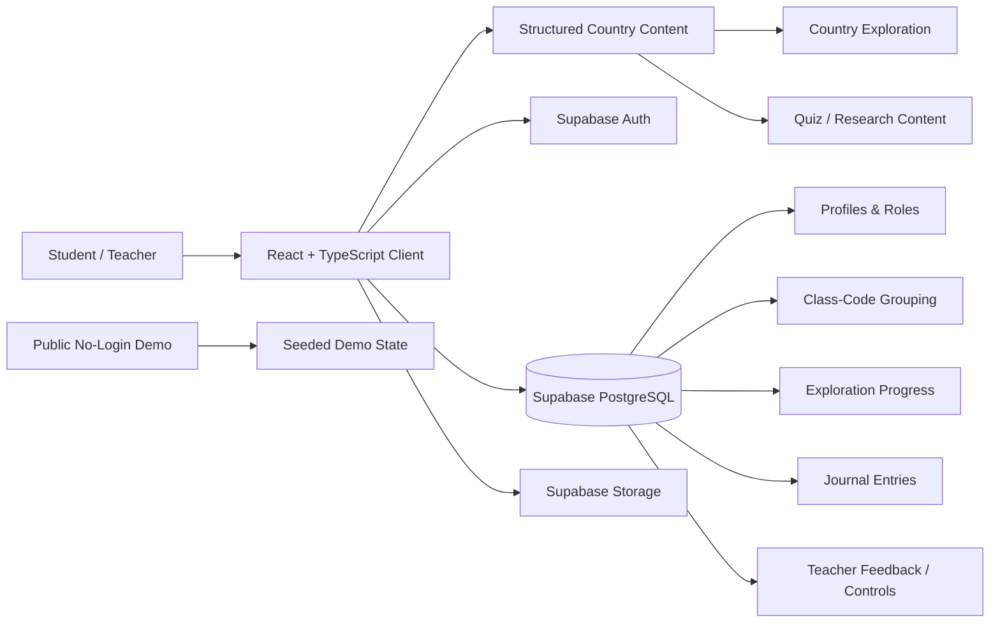
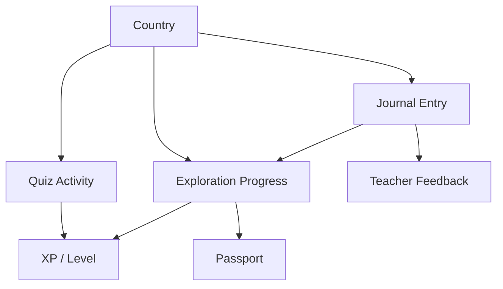

# Architecture

## Overview

Global Expedition Journal is a React/TypeScript educational application with a Supabase-backed relational data layer.

The system intentionally separates structured country/reference content, authenticated user and classroom data, student workflows, teacher workflows, and the public demonstration environment.

## High-Level Architecture

## Frontend

### Core technology

- React
- TypeScript
- Vite
- Tailwind CSS
- React Router
- TanStack Query
- React Hook Form
- react-simple-maps
- canvas-confetti
- Radix UI-based components

### Main application areas

The authenticated application includes routes and workflows for authentication, password recovery/update, dashboard, interactive map, country directory, country detail/exploration, journal, passport, student profile, teacher dashboard, settings, and progress/stat detail views.

## Structured Country Content

Country educational/reference content is stored as typed application data rather than as student-specific relational rows.

The country model includes fields such as ID, display name, flag, continent, map identifier, capital, language, population, famous food, landmark, fun fact, and quiz questions.

The dataset contains all 195 countries.

### Why this is separate

Reference content changes differently from user-generated data. Keeping it version-controlled provides predictable reads, typed development-time structure, simple local access for map/country UI, and straightforward review in source control.

The database is then reserved for authenticated state that benefits from relational modeling and access control.

## Supabase Data Layer

The relational application layer uses Supabase/PostgreSQL.

Core data areas include:

- **Profiles** — user-facing account/profile information
- **Roles** — student and teacher authorization state
- **Class-Code Grouping** — teacher and student profiles are associated through a shared class code
- **Explorations** — user-specific country progress
- **Journal Entries** — student reflection content and metadata
- **Teacher Feedback** — comments/ratings and related feedback
- **Teacher-Managed Content** — class tags/resources and related configuration

## Authorization

Security is designed in layers.

### Application layer

Teacher views are routed according to application role state.

### Database layer

Supabase Row Level Security policies constrain access to user/class data.

Examples of intended boundaries:

- students access their own student data
- teachers can access data associated with their classes
- protected data access does not depend only on hiding UI controls

## Product State

The goal is for visible progression to reflect meaningful learning activity rather than being an isolated game layer.

## Public Demo Architecture

The public demonstration environment is intentionally separate from the authenticated application.

It uses seeded demo state such as fictional student/teacher records, sample progress, sample journal entries, and representative class information.

This provides a low-friction portfolio experience while avoiding dependence on real organizational accounts or user data.

## Canvas LMS Boundary

Canvas is treated as a complementary learning environment rather than duplicated inside the application.

**Global Expedition Journal**
- self-paced discovery
- country exploration
- quizzes
- journal
- progress
- passport

**Canvas**
- structured assignments
- discussion
- reflection
- instructor-led experiences
- classroom community

A deeper direct integration could be added later if product requirements call for shared identity, grade synchronization, LTI, or API-based workflows.

## Security Considerations

This repository documents a working prototype, not a production security baseline. Before any wider deployment with real student data:

- keep Supabase service-role keys out of the client and repository
- use environment variables for public project configuration
- verify Row Level Security policies for every table
- verify storage bucket policies for journal/profile media
- separate demo/test data from real user data
- validate class/role workflows server-side or through database policies
- review account deletion and privacy behavior
- run dependency and secret scans as part of CI

## Production Hardening Opportunities

- automated browser/E2E tests
- CI build/lint/security checks
- centralized error monitoring
- audit/event logging
- accessibility regression checks
- content moderation/editorial workflows
- richer admin tooling
- rate limiting / abuse controls where applicable
